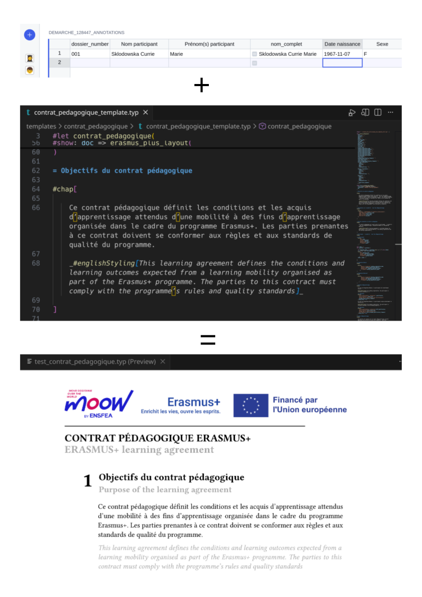

# 🐴 PonyExpress 

PonyExpress is a tool designed to export your data from Grist and use them to create sharp PDF using Typst. 
It can also upload them back to Grist if you need them there.

It was first created to handle Erasmus paperwork by the french Ministere de l'Agriculture.

See our [documentation](https://multi-coop.github.io/ponyexpress/tutorial/1_first_run/) to configure your own GRIST to PDF tool.

## Install 

[First run tutorial](
https://multi-coop.github.io/ponyexpress/tutorial/1_first_run/)

## Create custom PDF

[Create your own PDF](https://multi-coop.github.io/ponyexpress/tutorial/2_create_your_pdf/)

## Credits

This tool is built on top of 
- [pygrister](https://github.com/ricpol/pygrister) GRIST API library
- [typst](https://typst.app/) Latex heir
